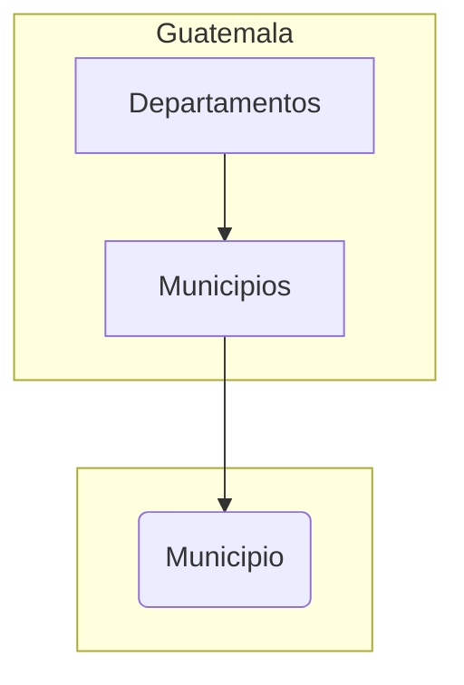

# Mapas TopoJSON de Guatemala

Son archivos geo espaciales con topología tipo TopoJSON del mapa de Guatemala, cuenta con 22 departamentos y 334 municipios, entre los graficos de municipios se muestra Belice

* [deptos.json](https://raw.githubusercontent.com/minfin-bi/mapas/main/deptos.json): 

|Atributo|Descripción|
|-|-|
|id|Código del departamento|
|Departamento|Nombre del departamento|

* [munis.json](https://raw.githubusercontent.com/minfin-bi/mapas/main/munis.json)

|Atributo|Descripción|
|-|-|
|id|Código del municipio|
|Municipio|Nombre del municipio|
|id_depto|Código del departamento|
|Departamento|Nombre del departamento|

* [muni.json](https://raw.githubusercontent.com/minfin-bi/mapas/main/munis.json):

|Atributo|Descripción|
|-|-|
|id|Código del municipio|
|id_muni|Código compuesto por el id departamento y el id municipio|
|Municipio|Nombre del municipio|

